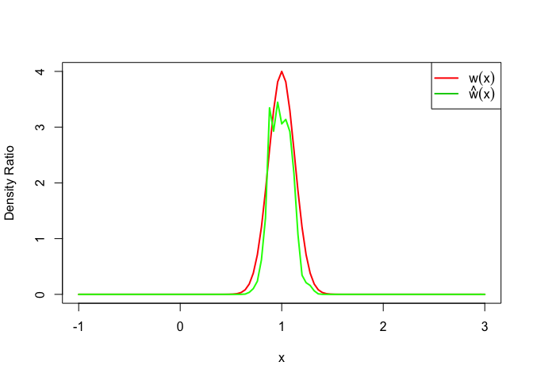

# An R Package for Density Ratio Estimation


## 1. Overview

**Density ratio estimation** is described as follows: for given two data samples `x` and `y` from unknown distributions `p_nu(x)` and `p_de(y)` respectively, estimate `w(x) = p_nu(x) / p_de(x)`, where `x` and `y` are d-dimensional real numbers.

The estimated density ratio function `w(x)` can be used in many applications such as the inlier-based outlier detection[1], covariate shift adaptation[2] and etc.

The package **densratio** provides the function `densratio()` that the result has the function to estimate density ratio `compute_density_ratio()`.

For example, 


```r
set.seed(3)
x <- rnorm(200, mean = 1, sd = 1/8)
y <- rnorm(200, mean = 1, sd = 1/2)

library(densratio)
result <- densratio(x, y)
result
```

```
## 
## Call:
## densratio(x = x, y = y, method = "uLSIF")
## 
## Kernel Information:
##   Kernel type:  Gaussian RBF 
##   Number of kernels:  100 
##   Bandwidth(sigma):  0.1 
##   Centers:  num [1:100, 1] 1.007 0.752 0.917 0.824 0.7 ...
## 
## Kernel Weights(alpha):
##   num [1:100] 0.4044 0.0479 0.1736 0.125 0.0597 ...
## 
## The Function to Estimate Density Ratio:
##   compute_density_ratio()
```

In this case, the true density ratio `w(x)` is known, so we can compare `w(x)` with the estimated density ratio `w-hat(x)`.


```r
true_density_ratio <- function(x) dnorm(x, 1, 1/8) / dnorm(x, 1, 1/2)
estimated_density_ratio <- result$compute_density_ratio

plot(true_density_ratio, xlim=c(-1, 3), lwd=2, col=2, xlab = "x", ylab = "density ratio")
plot(estimated_density_ratio, xlim=c(-1, 3), lwd=2, col=3, add=TRUE)
legend("topright", legend=c(expression(w(x)), expression(hat(w)(x))), col=2:3, lty=1, lwd=2, pch=NA)
```



## 2. How to Install

The source code for **densratio** package is available on GitHub at

- https://github.com/hoxo-m/densratio.

You can install the package from there.


```r
install.packages("devtools") # if you have not installed "devtools" package
devtools::install_github("hoxo-m/densratio")
```

## 3. Details

### 3.1. Basics

The package provides `densratio()` that the result has the function to estimate density ratio.

For data samples `x` and `y`,


```r
library(desnratio)

result <- densratio(x, y)
```

In this case, `result$compute_density_ratio()` can compute estimated density ratio.

### 3.2. Methods

`densratio()` has `method` parameter that you can pass `"uLSIF"` or `"KLIEP"`.

- **uLSIF** (unconstrained Least-Squares Importance Fitting) is the default method.
This method estimate density ratio by minimizing the squared loss.
You can find more information in Hido(2011)[1].

- **KLIEP** (Kullback-Leibler Importance Estimation Procedure) is the anothor method.
This method estimate density ratio by minimizing Kullback-Leibler divergence.
You can find more information in Sugiyama(2007)[2].

The both methods assume that the denity ratio is represented by linear model: 

`w(x) = alpha1 * K(x, c1) + alpha2 * K(x, c2) + ... + alphab * K(x, cb)`

where `K(x, c) = exp(- ||x - c||^2 / (2 * sigma ^ 2))` is the Gaussian RBF.

`densratio()` performs the two main jobs:

- First, deciding kernel parameter `sigma` by cross validation,
- Second, optimizing kernel weights `alpha`.

As the result, you can obtain `compute_density_ratio()`.

### 3.3. Result

`desnratio()` outputs the result like as follows:


```
## 
## Call:
## densratio(x = x, y = y, method = "uLSIF")
## 
## Kernel Information:
##   Kernel type:  Gaussian RBF 
##   Number of kernels:  100 
##   Bandwidth(sigma):  0.1 
##   Centers:  num [1:100, 1] 1.007 0.752 0.917 0.824 0.7 ...
## 
## Kernel Weights(alpha):
##   num [1:100] 0.4044 0.0479 0.1736 0.125 0.0597 ...
## 
## The Function to Estimate Density Ratio:
##   compute_density_ratio()
```


## References

[1] Hido, S., Tsuboi, Y., Kashima, H., Sugiyama, M., & Kanamori, T. 
Statistical outlier detection using direct density ratio estimation. 
Knowledge and Information Systems, vol.26, no.2, pp.309-336, 2011. 

[2] Sugiyama, M., Nakajima, S., Kashima, H., von Bünau, P. & Kawanabe, M. 
Direct importance estimation with model selection and its application to covariate shift adaptation. NIPS 2007.
