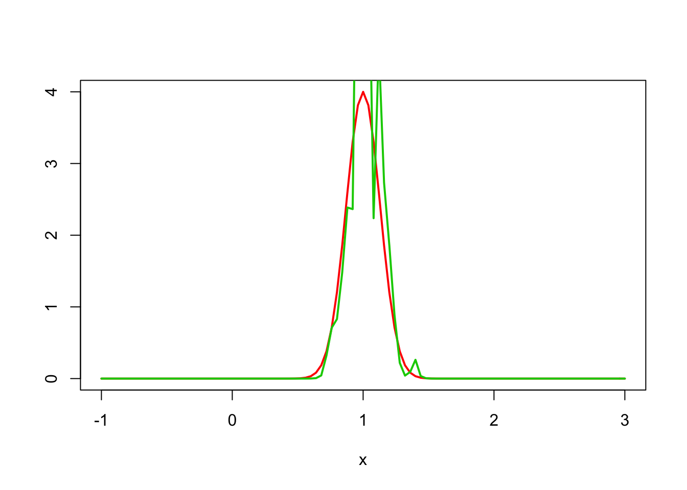
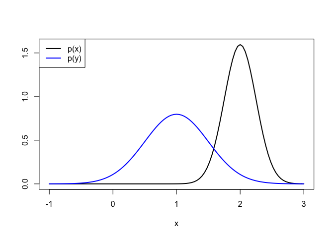
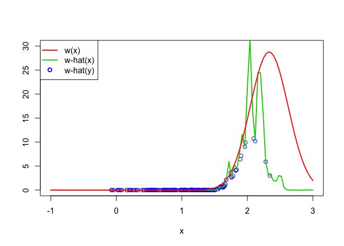

# An R Package for Density Ratio Estimation


## 1. Overviews

@Hido2010

@NIPS2007_232

## 2. How to Install

The source code for **densratio** package is available on GitHub at

- https://github.com/hoxo-m/densratio.

You can install the package from there.


```r
install.packages("devtools") # if you have not installed "devtools" package
devtools::install_github("hoxo-m/densratio")
```

## 3. Usage


```r
set.seed(71)
x <- rnorm(200, 1, 1/8)
y <- rnorm(200, 1, 1/2)

plot(function(x) dnorm(x, 1, 1/8), xlim=c(-1, 3), xlab="x", ylab="", lwd=2)
plot(function(x) dnorm(x, 1, 1/2), xlim=c(-1, 3), lwd=2, col=4, add=TRUE)
legend("topright", legend=c("p(x)","p(y)"), col=c(1,4), lwd=2)
```




```r
library(densratio)
result <- densratio(x, y)
```


```r
plot(y, result$y_density_ratio, xlim = c(-1, 3), ylim=c(0, 4), col = 4, xlab = "x", ylab = "")
plot(function(x) result$compute_density_ratio(x)[,1], xlim=c(-1, 3), lwd=2, col=3, add=TRUE)
plot(function(x) dnorm(x, 1, 1/8) / dnorm(x, 1, 1/2), xlim=c(-1, 3), lwd=2, col=2, add=TRUE)
legend("topright", legend=c("w(x)","w-hat(x)","w-hat(y)"), col=2:4, lty=c(1,1,NA), lwd=2, pch=c(NA,NA,1))
```


```r
x <- rnorm(1000, 2, 1/4)
y <- rnorm(200, 1, 1/2)

plot(function(x) dnorm(x, 2, 1/4), xlim=c(-1, 3), xlab="x", ylab="", lwd=2)
plot(function(x) dnorm(x, 1, 1/2), xlim=c(-1, 3), lwd=2, col=4, add=TRUE)
legend("topleft", legend=c("p(x)","p(y)"), col=c(1,4), lwd=2)
```




```r
result <- densratio(x, y)
```


```r
plot(y, result$y_density_ratio, xlim = c(-1, 3), ylim=c(0, 30), col = 4, xlab = "x", ylab = "")
plot(function(x) result$compute_density_ratio(x)[,1], xlim=c(-1, 3), lwd=2, col=3, add=TRUE)
plot(function(x) dnorm(x, 2, 1/4) / dnorm(x, 1, 1/2), xlim=c(-1, 3), lwd=2, col=2, add=TRUE)
legend("topleft", legend=c("w(x)","w-hat(x)","w-hat(y)"), col=2:4, lty=c(1,1,NA), lwd=2, pch=c(NA,NA,1))
```



## References
