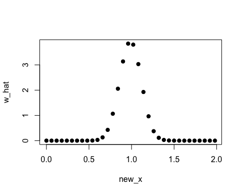
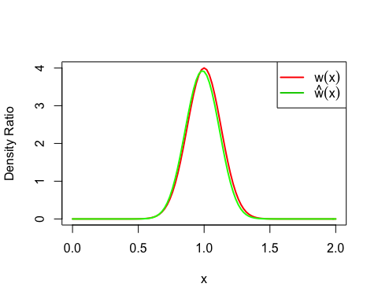
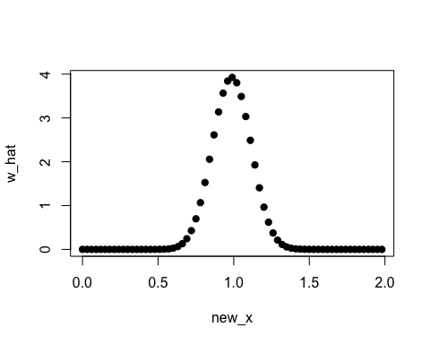
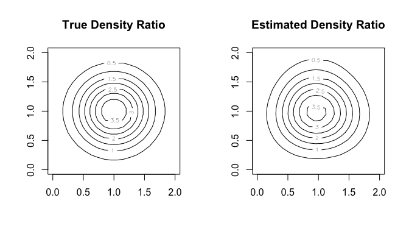

<!-- README.md is generated from README.Rmd. Please edit that file -->

# An R Package for Density Ratio Estimation

#### *Koji MAKIYAMA (@hoxo-m)*

<!-- badges: start -->

[](https://travis-ci.org/hoxo-m/densratio)
[](https://CRAN.R-project.org/package=densratio)
[](http://cranlogs.r-pkg.org/badges/densratio/)
[](https://coveralls.io/github/hoxo-m/densratio?branch=master)
[](https://saythanks.io/to/hoxo-m)
<!-- badges: end -->

## 1\. Overview

**Density ratio estimation** is described as follows: for given two data
samples `x1` and `x2` from unknown distributions `p(x)` and `q(x)`
respectively, estimate `w(x) = p(x) / q(x)`, where `x1` and `x2` are
d-dimensional real numbers.

The estimated density ratio function `w(x)` can be used in many
applications such as **anomaly detection** \[Hido et al. 2011\],
**changepoint detection** \[Liu et al. 2013\], and **covariate shift
adaptation** \[Sugiyama et al. 2007\]. Other useful applications about
density ratio estimation were summarized by \[Sugiyama et al. 2012\].

The package **densratio** provides a function `densratio()` that returns
an object with a method to estimate density ratio as
`compute_density_ratio()`.

For example,

``` r
set.seed(3)
x1 <- rnorm(200, mean = 1, sd = 1/8)
x2 <- rnorm(200, mean = 1, sd = 1/2)

library(densratio)
densratio_obj <- densratio(x1, x2)
```

The densratio object has a function `compute_density_ratio()` that can
compute the estimated density ratio `w_hat(x)` for any d-dimensional
input `x` (now d=1).

``` r
new_x <- seq(0, 2, by = 0.03)
w_hat <- densratio_obj$compute_density_ratio(new_x)

plot(new_x, w_hat, pch=19)
```

<!-- -->

In this case, the true density ratio `w(x) = p(x)/q(y) = Norm(1, 1/8) /
Norm(1, 1/2)` is known. So we can compare `w(x)` with the estimated
density ratio `w-hat(x)`.

``` r
true_density_ratio <- function(x) dnorm(x, 1, 1/8) / dnorm(x, 1, 1/2)

plot(true_density_ratio, xlim=c(0, 2), lwd=2, col="red", xlab = "x", ylab = "Density Ratio")
plot(densratio_obj$compute_density_ratio, xlim=c(0, 2), lwd=2, col="green", add=TRUE)
legend("topright", legend=c(expression(w(x)), expression(hat(w)(x))), col=2:3, lty=1, lwd=2, pch=NA)
```

<!-- -->

## 2\. Installation

You can install the **densratio** package from
[CRAN](https://CRAN.R-project.org/package=densratio).

``` r
install.packages("densratio")
```

You can also install the package from
[GitHub](https://github.com/hoxo-m/densratio).

``` r
install.packages("remotes") # if you have not installed "remotes" package
remotes::install_github("hoxo-m/densratio")
```

The source code for **densratio** package is available on GitHub at

  - <https://github.com/hoxo-m/densratio>.

## 3\. Details

### 3.1 Basics

The package provides `densratio()`. The function returns an object that
has a function to compute estimated density ratio.

For data samples `x1` and `x2`,

``` r
set.seed(3)
x1 <- rnorm(200, mean = 1, sd = 1/8)
x2 <- rnorm(200, mean = 1, sd = 1/2)

library(densratio)
densratio_obj <- densratio(x1, x2)
```

In this case, `densratio_obj$compute_density_ratio()` can compute
estimated density ratio.

``` r
new_x <- seq(0, 2, by = 0.03)
w_hat <- densratio_obj$compute_density_ratio(new_x)

plot(new_x, w_hat, pch=19)
```

<!-- -->

### 3.2 Methods

`densratio()` has `method` argument that you can pass `"uLSIF"`,
`"RuSLIF"`, or `"KLIEP"`.

  - **uLSIF** (unconstrained Least-Squares Importance Fitting) is the
    default method. This algorithm estimates density ratio by minimizing
    the squared loss. You can find more information in \[Kanamori et
    al. 2009\] and \[Hido et al. 2011\].
  - **RuLSIF** (Relative unconstrained Least-Squares Importance
    Fitting). This algorithm estimates relative density ratio by
    minimizing the squared loss. You can find more information in
    \[Yamada et al. 2011\] and \[Liu et al. 2013\].
  - **KLIEP** (Kullback-Leibler Importance Estimation Procedure). This
    algorithm estimates density ratio by minimizing Kullback-Leibler
    divergence. You can find more information in \[Sugiyama et
    al. 2007\].

The methods assume that density ratio are represented by linear model:

  - `w(x) = theta_1 * K(x, c_1) + theta_2 * K(x, c_2) + ... + theta_b *
    K(x, c_b)`

where

  - `K(x, c) = exp(-||x - c||^2 / 2 * sigma^2)`

is the Gaussian (RBF) kernel.

`densratio()` performs the following:

  - Decides kernel parameter `sigma` by cross-validation,
  - Optimizes the kernel weights `theta` (in other words, find the
    optimal coefficients of the linear model), and
  - The parameters `sigma` and `theta` are saved into `densratio`
    object, and are used when to compute density ratio in the call
    `compute_density_ratio()`.

### 3.3 Result and Arguments

`densratio()` outputs the result like as follows:

    #> 
    #> Call:
    #> densratio(x = x1, y = x2, method = "uLSIF")
    #> 
    #> Kernel Information:
    #>   Kernel type:  Gaussian 
    #>   Number of kernels:  100 
    #>   Bandwidth(sigma):  0.1 
    #>   Centers:  num [1:100, 1] 0.907 1.093 1.18 1.136 1.046 ...
    #> 
    #> Kernel Weights:
    #>   num [1:100] 0.067455 0.040045 0.000459 0.016849 0.067084 ...
    #> 
    #> Regularization Parameter (lambda):  1 
    #> 
    #> Function to Estimate Density Ratio:
    #>   compute_density_ratio()

  - **Kernel type** is fixed as Gaussian.
  - **Number of kernels** is the number of kernels in the linear model.
    You can change by setting `kernel_num` argument. In default,
    `kernel_num = 100`.
  - **Bandwidth (sigma)** is the Gaussian kernel bandwidth. In default,
    `sigma = "auto"`, the algorithm automatically select an optimal
    value by cross validation. If you set `sigma` a number, that will be
    used. If you set `sigma` a numeric vector, the algorithm select an
    optimal value in them by cross validation.
  - **Centers** are centers of Gaussian kernels in the linear model.
    These are selected at random from the data sample `x1` underlying a
    numerator distribution `p(x)`. You can find the whole values in
    `result$kernel_info$centers`.
  - **Kernel Weights** are `theta` parameters in the linear kernel
    model. You can find these values in `result$kernel_weights`.
  - **Function to Estimate Density Ratio** is named
    `compute_density_ratio()`.

## 4\. Multi Dimensional Data Samples

So far, the input data samples `x1` and `x2` were one dimensional.
`densratio()` allows to input multidimensional data samples as `matrix`,
as long as their dimensions are the same.

For example,

``` r
library(densratio)
library(mvtnorm)

set.seed(3)
x1 <- rmvnorm(300, mean = c(1, 1), sigma = diag(1/8, 2))
x2 <- rmvnorm(300, mean = c(1, 1), sigma = diag(1/2, 2))

densratio_obj_2d <- densratio(x1, x2)
densratio_obj_2d
#> 
#> Call:
#> densratio(x = x1, y = x2, method = "uLSIF")
#> 
#> Kernel Information:
#>   Kernel type:  Gaussian 
#>   Number of kernels:  100 
#>   Bandwidth(sigma):  0.316 
#>   Centers:  num [1:100, 1:2] 1.257 0.758 1.122 1.3 1.386 ...
#> 
#> Kernel Weights:
#>   num [1:100] 0.0756 0.0986 0.059 0.0797 0.0421 ...
#> 
#> Regularization Parameter (lambda):  0.3162278 
#> 
#> Function to Estimate Density Ratio:
#>   compute_density_ratio()
```

In this case, as well, we can compare the true density ratio with the
estimated density ratio.

``` r
true_density_ratio <- function(x) {
  dmvnorm(x, mean = c(1, 1), sigma = diag(1/8, 2)) /
    dmvnorm(x, mean = c(1, 1), sigma = diag(1/2, 2))
}

N <- 20
range <- seq(0, 2, length.out = N)
input <- expand.grid(range, range)
w_true <- matrix(true_density_ratio(input), nrow = N)
w_hat <- matrix(densratio_obj_2d$compute_density_ratio(input), nrow = N)

par(mfrow = c(1, 2))
contour(range, range, w_true, main = "True Density Ratio")
contour(range, range, w_hat, main = "Estimated Density Ratio")
```

<!-- -->

## 5\. Related work

  - A Python Package for Density Ratio Estimation
      - <https://pypi.org/project/densratio/>
  - APPEstimation: Adjusted Prediction Model Performance Estimation
      - <https://cran.r-project.org/package=APPEstimation>

## References

  - Hido, S., Y. Tsuboi, H. Kashima, M. Sugiyama, and T. Kanamori.
    **Statistical outlier detection using direct density ratio
    estimation.** Knowledge and Information Systems, 2011.
  - Kanamori, T., S. Hido, and M. Sugiyama. **A least-squares approach
    to direct importance estimation.** Journal of Machine Learning
    Research, 2009.
  - Liu, S., M. Yamada, N. Collier, M. Sugiyama. **Change-point
    detection in time-series data by relative density-ratio
    estimation.** Neural Net, 2013
  - Sugiyama, M., S. Nakajima, H. Kashima, P. von Bünau, and M.
    Kawanabe. **Direct importance estimation with model selection and
    its application to covariate shift adaptation.** NIPS 2007.
  - Sugiyama, M., T. Suzuki, and T. Kanamori. **Density ratio estimation
    in machine learning.** Cambridge University Press, 2012.
  - Yamada, M., T. Suzuki, T. Kanamori, H. Hachiya, and M. Sugiyama.
    **Relative density-ratio estimation for robust distribution
    comparison.** NIPS 2011.
